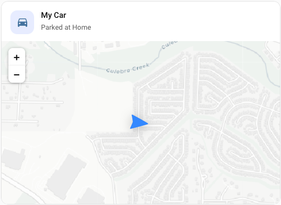
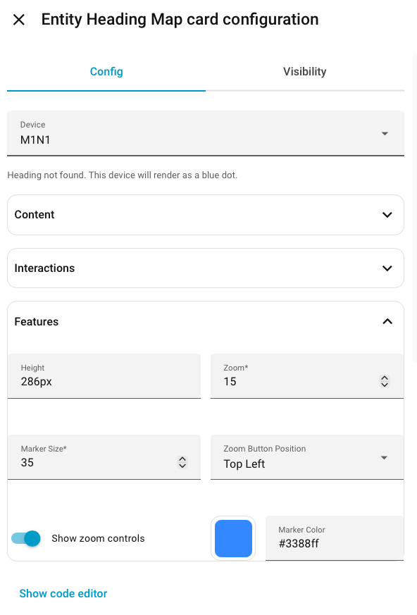

# Entity Heading Map Card

[](https://github.com/tn9design/entity-heading-map-card)
[](https://www.hacs.xyz/)

`entity-heading-map-card` is a Home Assistant Lovelace card for showing one or more entities on a live map with a directional heading marker and various customization options.
<p align="left">
  
</p>
It is designed for tracked objects such as:

- vehicles
- people
- boats
- aircraft
- bikes
- anything else that exposes coordinates and an optional heading

The card uses Leaflet with CARTO light tiles by default, so there is no API key, account setup, or paid map provider required.


## Features

- HACS-friendly frontend card
- No-key CARTO light map tiles by default
- Supports one or many entities
- Rotated heading arrow when heading is available
- Blue dot fallback when heading is not available
- Auto-fit bounds for multiple markers
- Home Assistant UI editor with device auto-discovery
- Works with either:
  - a single entity that exposes `latitude` and `longitude` as attributes
  - separate entities for latitude, longitude, and heading
- Optional header icon and subtitle
- Configurable tap action and icon tap action
- Configurable marker color, zoom, height, zoom controls, and tile layer

## Installation

[](https://my.home-assistant.io/redirect/hacs_repository/?owner=tn9design&repository=entity-heading-map-card)

### HACS Custom Repository

1. Open `HACS` -> `Custom repositories`.
2. Add:
   Repository: `tn9design/entity-heading-map-card`
   Type: `Dashboard`
3. Install `Entity Heading Map Card`.

### How HACS Installs This Card

HACS installs the repository under `www/community/entity-heading-map-card/`, and the dashboard file it uses is:

`entity-heading-map-card.js`

That file is selected by `hacs.json`:

```json
{
  "content_in_root": false,
  "filename": "entity-heading-map-card.js"
}
```

So it is normal to see supporting files like `README.md`, `src/`, `scripts/`, and `package.json` in the installed folder even though Home Assistant only loads the published JavaScript file at runtime.

## Basic Usage

### UI Editor

The built-in Home Assistant card editor can automatically discover compatible devices from the device and entity registries.

- Devices with latitude and longitude are selectable
- Devices with heading render as arrows
- Devices without heading render as blue dots

The editor also supports:

- custom title
- subtitle
- optional icon
- tap behavior
- icon tap behavior
- zoom and marker sizing
- zoom button visibility and position

### Single Entity With Lat/Lon Attributes

```yaml
type: custom:entity-heading-map-card
title: Tracker
entity: device_tracker.my_tracker
heading_entity: sensor.my_tracker_heading
```

### One Marker Using Separate Entities

```yaml
type: custom:entity-heading-map-card
title: Tesla Model S
latitude_entity: sensor.tesla_model_s_latitude
longitude_entity: sensor.tesla_model_s_longitude
heading_entity: sensor.tesla_model_s_heading
```

### Multiple Markers

```yaml
type: custom:entity-heading-map-card
title: Teslas
fit_bounds: true
entities:
  - name: Tesla Model S
    latitude_entity: sensor.tesla_model_s_latitude
    longitude_entity: sensor.tesla_model_s_longitude
    heading_entity: sensor.tesla_model_s_heading
    color: "#3388ff"
  - name: Tesla Model 3
    latitude_entity: sensor.tesla_model_3_latitude
    longitude_entity: sensor.tesla_model_3_longitude
    heading_entity: sensor.tesla_model_3_heading
    color: "#ff5a5f"
```

<table border="0" cellpadding="0" cellspacing="0" style="border:none;">
  <tr>
    <td valign="top" style="border:none;">
      
## Configuration

Top-level options:

- `title`: Optional card title
- `subtitle`: Optional subtitle shown below the title
- `icon`: Optional Home Assistant icon shown to the left of the header
- `height`: Map height in pixels or CSS string. Default: `320px`
- `zoom`: Default zoom for a single marker. Default: `16`
- `fit_bounds`: Fit all markers into view when more than one marker is present. Default: `true`
- `entity`: A single entity with `latitude` and `longitude` attributes
- `device_id`: Optional device id used by the UI editor to auto-resolve compatible entities
- `latitude_entity`: Entity whose state is the latitude
- `longitude_entity`: Entity whose state is the longitude
- `heading_entity`: Optional entity whose state is the heading in degrees
- `color`: Default marker color
- `show_zoom_controls`: Show or hide Leaflet zoom buttons. Default: `true`
- `zoom_control_position`: `topleft`, `topright`, `bottomleft`, or `bottomright`
- `tap_action`: Card tap action. Default: more-info
- `icon_tap_action`: Icon tap action. Default: none
- `tile_url`: Tile URL template. Default: CARTO light tiles
- `tile_attribution`: Attribution string for the tile layer
- `tile_subdomains`: Tile subdomain string. Default: `abcd`
- `show_attribution`: Show or hide map attribution. Default: `false`
- `entities`: Array of marker definitions

</td>
    <td valign="top">
      
    </td>
  </tr>
</table>

Per-marker options inside `entities`:

- `name`: Marker label
- `entity`: Entity with `latitude` and `longitude` attributes
- `latitude_entity`: Latitude entity
- `longitude_entity`: Longitude entity
- `heading_entity`: Optional heading entity
- `color`: Marker color override

## Notes

- The default heading marker uses a rounded SVG arrow rotated clockwise in degrees.
- If no heading is available, the card shows a blue dot instead of an arrow.
- For public or large-scale use, consider overriding the default tile layer with a provider appropriate for your usage.

## Development

The current scaffold keeps the source file in `src/` and copies it to `dist/`:

```bash
npm run build
```
